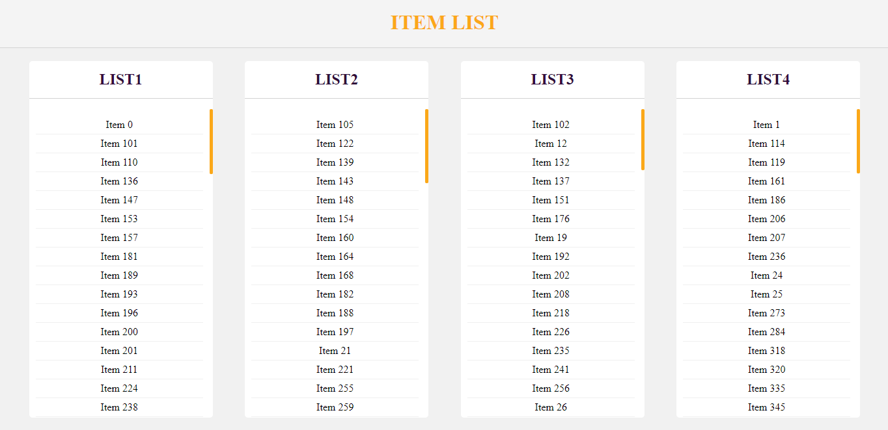

# List Presentation

This project shows several lists that are retrieved from https://fetch-hiring.s3.amazonaws.com/hiring.json

## Live Preview

[Visit live preview](https://deployed.d287vhzwji07e2.amplifyapp.com/)

## Screenshot

## Features

- All items are separated into lists by their listId attribute.
- Each list is sorted by their item's names.
- Items with null or empty names have been removed.
- Presentation is flexible and adjusts to medium to large screen sizes (not completely responsive).
- The app will show as many lists as found in the results received, based on the maximum listId.

## Setup

1. Clone this repository and access the project's directory.
2. Run "npm install".
3. Run "npm start" to work on the development server.

## Built With

- JavaScript/ES6
- React
- React Hooks
- AWS Amplify

## Author

👤 **Sebastian Gil Rodriguez**

- Website: [sebgil.me](https://sebgil.me)
- Github: [@sebGilR](https://github.com/sebGilR)
- Twitter: [@sebGilR](https://twitter.com/sebGilR)
- Linkedin: [sebastiangilrodriguez](https://www.linkedin.com/in/sebastiangilrodriguez)
